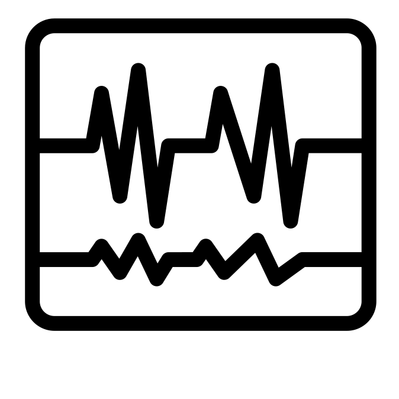

# Deep Scientific Discovery
This repository contains code for the paper [Using Deep Networks for Scientific Discovery in Physiological Signals](https://www.mlforhc.org/accepted-papers)

*Tom Beer, Bar Eini-Porat, Sebastian Goodfellow, Danny Eytan and Uri Shalit*

**Proceedings of Machine Learning for Healthcare, 2020**

### To apply the method on your task
Integrate `HSICClassifier` from `networks.py` and `HSICLoss` from `hsic.py` in your classification task

### ❤️ To run the ECG experiments
1. Download and preprocess the PhysioNet 2017 data by running
    ```python
    python -m ECG.prepare_dataset
    ```
2. Train the main task
    ```python
    python -m ECG.train_main_task
    ```
    
3. To evaluate model validity, you may want to run
    ```python
    python -m ECG.train_independence
    python -m ECG.train_rep2label
    ```
4. To visualize the obtained activations:
    ```python
    python -m ECG.visualize_cam
    ```
    
### 🧠 To run the EEG experiments
Follow the same steps as in the ECG experiment above, replacing `ECG` with `EEG`

----

logo created by [Atif Arshad](https://thenounproject.com/search/?q=ecg&i=1295489) from the Noun Project
